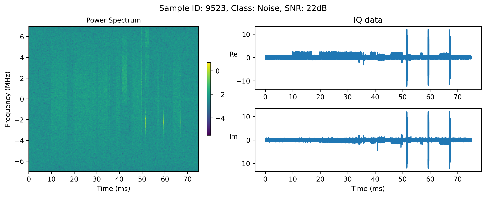
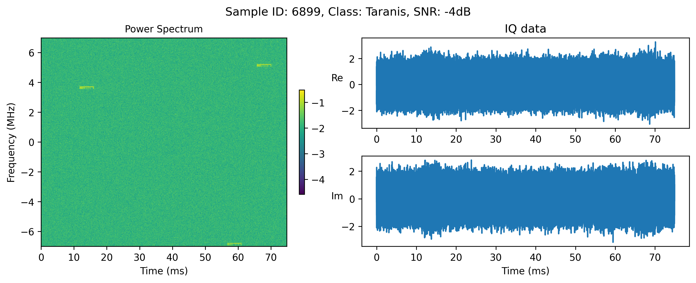

# Noisy Drone RF Signal Classification v2 Dataset
Scripts to load and inspect the Noisy Drone RF Signal Classification v2 Dataset

## Dataset
The dataset is available at [kaggle](https://www.kaggle.com/datasets/sgluege/noisy-drone-rf-signal-classification-v2). Download the dataset and place it in a subfolder `data/`. 

It comes in the form of 3 filetypes:
- `class_stats.csv`: a single file containing the number of samples per class
- `SNR_stats.csv`:  a single file containing the number of samples per SNR
- `IQdata_sampleX_targetY_snrZ.pt`: sample files that contain the IQ signal of sample X, with target Y at SNR level of Z

## Load and inspect the dataset
Use the script `load_dataset.py` to load the dataset using a custom torch Dataloader. It also plots a sample of the dataset which should look like this: 






Note that we plot the power spectrum of the IQ signal, which is the log10 of the absolute value of the FFT of the IQ signal 
```python
power_spec = np.log10(np.sqrt(spectrogram_2d[0,:,:]**2 + spectrogram_2d[1,:,:]**2))
```
## Related Literature

Further information about the data, and how to build a classifier, can be found in our related manuscript. Please cite it if you find it useful.

S. Glüge, M. Nyfeler, A. Aghaebrahimian, N. Ramagnano and C. Schüpbach, Robust Low-Cost Drone Detection and Classification in Low SNR Environments, arXiv:2406.18624 [eess.SP], https://arxiv.org/abs/2406.18624

Bibtex:
```
@misc{glüge2024robustlowcostdronedetection,
title={Robust Low-Cost Drone Detection and Classification in Low SNR Environments},
author={Stefan Glüge and Matthias Nyfeler and Ahmad Aghaebrahimian and Nicola Ramagnano and Christof Schüpbach},
year={2024},
eprint={2406.18624},
archivePrefix={arXiv},
primaryClass={eess.SP},
url={https://arxiv.org/abs/2406.18624},
}
```
